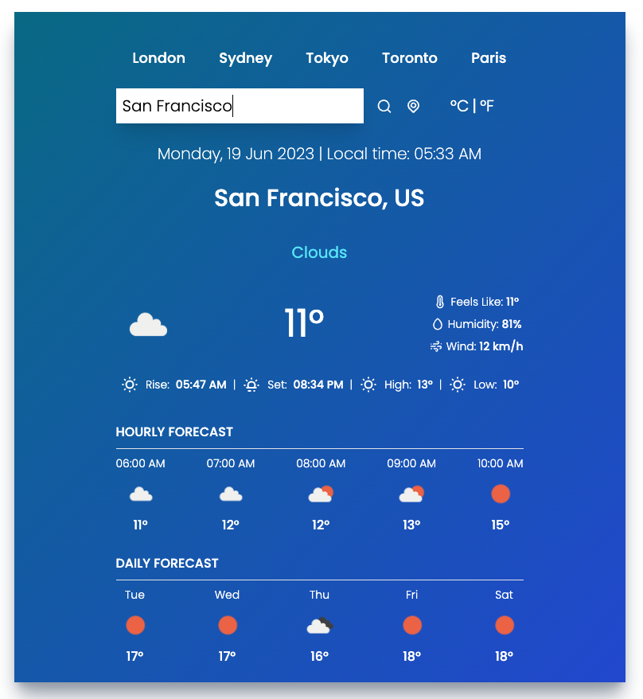
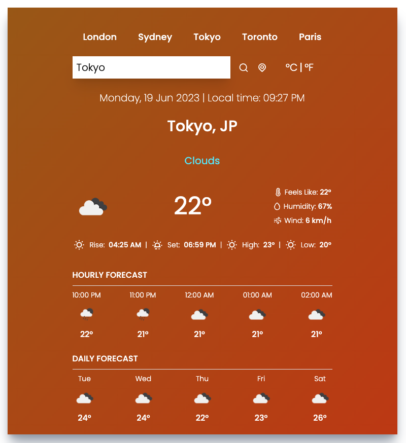

# Weather Forecast App

A web application that provides real-time weather data using the OpenWeatherMap API. Includes features such hourly and daily forecasts, current temperature, 'feels like' temperature, humidity levels, wind speed, sunrise and sunset times and displays information about the date & time of the searched location. Other features include a geo-location search button, metric / imperial temperature switching and the high/ low termperatures of the day.

 

  
  

 

## Deployed With Netlify

[Visit the site here!](https://darling-sable-723a82.netlify.app/)

 

## Tech Stack

- JavaScript 
- React
- Tailwind

 

## Built With
- Luxon
- Toastify
- Vite
- OpenWeatherMap API
- Icons: https://iconscout.com/

 

## How to Use

1. Clone this repository to your local machine.
2. Run `npm install` to install all dependencies.
3. Create a `.env` file at the root of your project and add your OpenWeatherMap API key as `VITE_APP_API_KEY`.
4. Run `npm run dev` to start the development server. The application should open in your default browser.
5. Enter your location and see the weather data!

